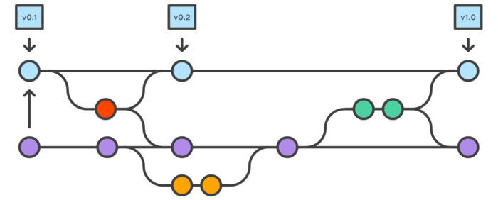
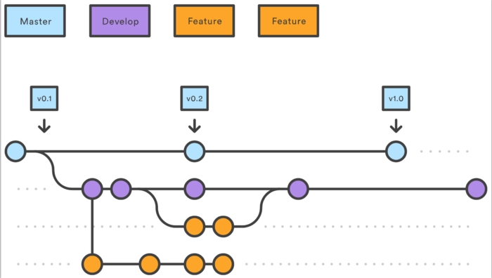
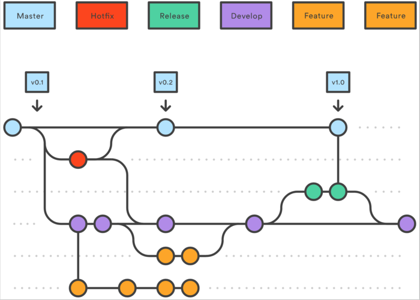

## Git Flow 工作流程
https://www.jianshu.com/p/9a76e9aa9534

### 提交的准则
1.除了源码相关的东西之外，其他build产生的东西（如：maven的target文件夹，.idea文件夹等），均不能提交进入源码仓库，添加到.gitignore文件中忽略掉。

2.撰写规范的提交说明。一份好的提交说明可以帮助协作者更轻松更有效地配合工作。

3.要严格按照我们指定的流程切换到指定分支，开发相应的功能。


### 分支简述



- 天蓝色圆点所在的线为我们源码的主线（master）
- 天蓝色方形指向的节点就是每一个发布版本的标签（tag）
- 紫色圆点所在的线为主要分支线（develop）
- 橙色圆点所在的线为新功能开发分支线（feature）
- 绿色圆点所在的线为新版本发布线（release）
- 红色圆点所在的线为发布版本bug修复线（hotfix）


### 主分支说明
代替原来的单个主线（master），我们使用两个分支来记录源码轨迹：
1. 原来的master分支用来记录官方发布轨迹；
2. 新的develop分支是一个集成分支，用来记录开发新功能的轨迹。

除了master主线和develop主分支线，其他的分支都是临时的分支，有一定的生命周期的，其余的工作流程分支都是围绕这两个分支之间的区别进行的。


### 其他分支说明
#### 新功能分支（Feature Branches）
每一个新的功能都应该创建一个独立的分支，从develop分支中派生出来。当功能完成后，要合并（merged）回develop分支，合并后它的生命周期就结束。新功能分支不会与master分支有直接的交汇。如图：


#### 发布分支（Release Branches）
一旦开发的功能已经满足发布条件（或预定发布日期接近），应该合并所有满足发布条件的新功能分支到develop分支中，然后，开出一个发布分支（Release），开始准备一个发布版本。在这个分支上，不能再添加新的功能，只有bug修复和该版本为导向的任务。一旦到了发布日期，Release就要合并回master发布，并且，打出版本标签。另外，还需要合并回develop分支。


使用一个专门的分支来准备发布版本，使得一个团队能对当前版本进行抛光，而另一个团队继续为下一个版本的功能做准备。它还创造了良好定义的发展阶段（例如，很容易说，“本周我们正在准备4.0版”，而且真实地看到它在库中的结构）。

#### 维护分支（Maintenance Branches）
维护分支也就是线上bug修复分支，使用来快速修复生产环境的紧急问题。

这个分支是唯一一个开放过程中直接从master分支派生来的分支。快速的修复问题后，它应该被合并回master和develop（或者当前发布分支），然后，master分支需要打一个版本标签。

一个专门的错误修复开发线，可以让团队在不等待下一个发布周期，导致中断工作流程情况下解决问题。可以将维护分支当做主要的问题修复分支，与master并行。

### 命名约定
- 主分支名称：master
- 主开发分支名称：develop
- 标签（tag）名称：v*.RELEASE，其中”*“ 为版本号，“RELEASE”大写，如：v1.0.0.RELEASE
- 新功能开发分支名称：feature-*or feature/*，其中“*” 为新功能简述，如：feature-item-activity-list
- 发布分支名称：release-*or release/*，其中*为版本号，“release”小写，如：release-1.0.0
- master的bug修复分支名称：hotfix-*or hotfix/*，其中*为bug简述，如：hotfix/item-update-bug

### 工作流程
- 创建develop分支,推送到服务器
```
git branch develop
git push -u origin develop
```
- 其他开发人员，克隆develop仓库的源码，创建develop的轨迹版本
```
git clone git@github.org:search-cloud/demo.git
git checkout -b develop origin/develop
```
develop这个分支将包含项目的完整历史记录，而master将包含缩略版本。

### 新功能开发流程
1. 新建feature分支
```
git checkout -b feature/demo develop
```
推送到远程仓库，共享：
```
git push

```
所有开发此新功能的人员，都在此分支上开发提交代码。

```
git status
git add
git commit -m "Add some-file."
```
2. 完成新功能开发（合并feature分支到develop）
当确定新功能开发完成，且联调测试通过，并且新功能负责人已经得到合并feature分支到develop分支的允许；这样才能合并feature分支到develop。

- 新功能分支，永远不要直接合并到master分支。
- 合并可能会有冲突，应该谨慎处理冲突。

3. 在测试环境发布develop分支代码（提交测试）

### 线上版本发布流程
1. 从develop中创建准备发布的release分支

当主测试流程完成，源码已经趋近于稳定状态，应该准备一个发布版本，确立版本号：
```
git checkout -b release-0.1.0 develop
```
推送到远程仓库共享：
```
git push
```
这个分支是清理准备发布、 整体回归测试、 更新文档，和做其他任何系统即将发布的事情。

2. 继续抛光改bug
3. release分支合并到master发布

一旦已经满足发布条件（或已经到了预定发布日期），应该把release分支合并到master分支和develop分支中，然后，使用master发布新版本。合并release分支到develop分支是很重要的，要让release上修改的东西能在后续的开发分支中生效。
```
git checkout master
git merge release-0.1.0
git push
```

4. release分支合并到develop
```
git checkout develop
git merge release-0.1.0
git push
git branch -d release-0.1.0
```

5. 打tag

Release分支在功能开发分支（develop）和公共发布版（master）中，充当一个缓冲的作用。每当有源码合并到master中的时候，应该在master上打一个标签，以便后续跟踪查阅。
```
git tag -a 0.1.0.RELEASE -m "Initial public release" master
git push --tags
```

### 线上bug修复流程
1. 创建hotfix分支
```
git checkout -b issue-#001 master
```
2. 修改bug Fix the bug
3. 完成修复，合并到master发布
```
git checkout master
git merge issue-#001
git push
```
4. 打tag
```
git tag -a 0.1.1.RELEASE -m "Initial public release" master
git push --tags
```
5. 合并到develop
```
git checkout develop
git merge issue-#001
git push
```


---
## git 常用命令
- clone
    - git init 创建仓库
    - git clone ssh/http clone库,ssh最快
    - git remote -v 查看远程库信息
- 工作区
    - 版本库(Repository,.git)：存了很多东西,包括：暂存区(stage)、分支(branch)、指针(HEAD)等
- git add   (把本地文件添加到暂存区)
    git add -A   保存所有的修改
            .    保存新的添加和修改，但是不包括删除
            -u   保存修改和删除，但是不包括新建文件
-   git commit  -m  'update' (把暂存区的所有内容提交到当前分支 "保存快照")
-   git push [remote-name] [local-branch]:[remote-branch]
    git push -u origin master 第一次推送,同时把远程master分支和本地master分支关联起来
-   git diff filename  
    git diff           # 尚未add (unstaged)
    git diff --cached  # 已add
    git diff HEAD      # 同时查看 add 过 (staged) 和 没 add (unstaged) 的修改
-  git log --pretty=oneline 查看所有的commit历史(精简)

- 回到过去
    - git commit --amend --no-edit   # 将新的修改直接合并到上一个commit，不改变上一个commit的comment
    - git reset filename # 撤销已经add的文件，回到unstaged状态
    - git reset --hard commitid 撤销暂存区的修改
        - git add + git commit 良好习惯，将修改的代码保存，一旦发生状况，可以回退到最近的commit
        - HEAD表示当前版本,HEAD^表示上个版本,HEAD~2表示往前2个版本
        - git reflog 记录HEAD的每一次变化，包括已经撤销的commit
    - git rm -r --cached filename   # 删除已add/commit的修改
    - git checkout -- filename [commit id] # 回退单个文件
    - others
        - 撤销最近的一个提交：git revert HEAD
        - 取消commit+add ： git reset --mixed
        - 取消commit ： git reset --soft
        - 取消commit+add+local working ： git reset --hard 

- 从远程库中下载新的改动
    - git pull  (pull=fetch+merge)
    - 或者,使提交线图更好看,方便code review
    git pull --rebase  如果有冲突,则对比commit的代码,修改本地代码
    git add .
    git rebase --continue

- 分支：master分支非常稳定，仅用来发布新版本，平时不在上面干活，干活在dev分支上。
    - git branch branchname  创建分支 
        - git branch/checkout -b 创建并切换
        - git branch -d branchname 删除分支
        - git branch  查看分支
    - git checkout branchname 切换分支
    - git merge branchname 合并分支到master,默认Fast forward,如要禁止Fast forward, git merge --no-ff,可以追溯历史
        - 遇到conflict，则手动解决confilit，再commit
    - git rebase # 危险的命令，场景：brance基于（base）的master有修改，将master上新的修改加入base中
    - git log --graph 看分支图日志
    - 正在工作的时候想切换到其它分支，并且不想提交现有的工作
        git stash 把工作现场“储藏”起来,等以后恢复现场后继续工作
        git stash list
        git stash pop 恢复工作现场,并且把stash内容删除
    - git branch --set-upstream-to=origin/branchname branchname 关联到远程仓库
    - git push --set-upstream origin branchname 推送到新分支

### fork流程
- 重命名url为upstream ：git remote add upstream http:/xxxxx
拉取源仓库的改动，更新本地仓库
- git fetch upstream
- git checkout develop  # 切换到develop分支
- git rebase upstream/develop   (or git merge upstream/develop)
- 若报confilict：修改conflict
- git rebase --continue
- 更新远程仓库：git push
- 更新源仓库：发起merge request


- 标签：版本库的快照，指向某个commit的指针，作用：比commitid更简单
    - git tag V1.0 -m '附注信息'   # tag打在最新提交的commit上
    - git tag V1.0 commitid(前几位就可以了) 打在任意commit id上
    - 查看标签：git tag  # 按字母排序
    - git show 查看标签信息
    - tag 远程推送：git push origin V1.0/--tags
    - 删除标签（本地）：git tag -d v1.0
    - 删除标签（远程）：git push origin :refs/tags/V1.2

- 添加不上传的文件路径
    - vim .gitignore


