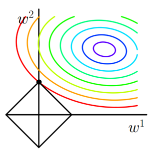

### 平台 （平行化）
- MPI
- XGBOOST
- Parameter Server
- MxNet
- TenserFlow

### 数据
- 去噪声、去极值、负样本降采样
- 特征：
	- 特征设计
	- 特征选择：L1正则化
	    
	- 特征组合：
		- GBDT+LR
		- 深度学习

### 模型
- LR
	- 实时：FTRL
	- 特征自动组合：FM
- 非线性
	- GBDT
- 深度学习
	- DNN
	- CNN
	- RNN
- 融合
	- bagging：加权平均
	- 级联：模型的中间结果输出到另一个模型
	- Wide & Deep		

### 排序
- 多目标优化
- multi-armed bandit

### 评价指标
- ROC
- ks检验