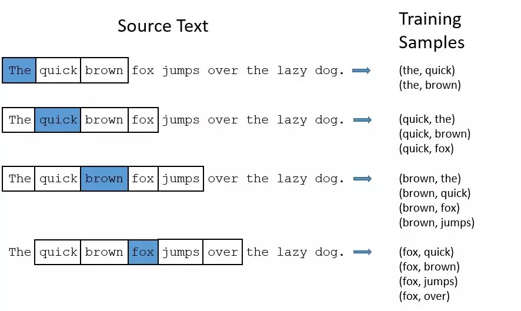

1、词的独热表示

到目前为止最常用的词表示方法是 One-hot Representation，这种方法把每个词表示为一个很长的向量。这个向量的维度是词表大小，其中绝大多数元素为 0，只有一个维度的值为 1，这个向量就代表了当前的词。

“可爱”表示为 [0 0 0 1 0 0 0 0 0 0 0 0 0 0 0 0 ...] 
“面包”表示为 [0 0 0 0 0 0 0 0 1 0 0 0 0 0 0 0 ...]

每个词都是茫茫 0 海中的一个 1。这种 One-hot Representation 如果采用稀疏方式存储，会是非常的简洁：也就是给每个词分配一个数字 ID。比如刚才的例子中，可爱记为 3，面包记为 8（假设从 0 开始记）。

缺点分析： 
- 向量的维度会随着句子的词的数量类型增大而增大； 
- **任意两个词之间都是孤立的，无法表示语义层面上词汇之间的相关信息，而这一点是致命的**。

2、词的分布式表示

传统的独热表示仅仅将词符号化，不包含任何语义信息。如何将语义融入到词表示中？Harris 在 1954 年提出的“分布假说”为这一设想提供了理论基础：上下文相似的词，其语义也相似。Firth 在 1957年对分布假说进行了进一步阐述和明确：**词的语义由其上下文决定**。

以（**CBOW**）为例，如果有一个句子“the cat sits one the mat”，在训练的时候，将“the cat sits one the”作为输入，预测出最后一个词是“mat”。 

分布式表示的较大优点在于它具有非常强大的表征能力，比如n维向量每维k个值，可以表征k的n次方个概念。下图的神经网络语言模型（NNLM）采用的就是文本分布式表示。而词向量(word embedding)是训练该语言模型的一个附加产物，即图中的Matrix C。

所以我们可以将我们的任务拆解成两部分： 
一、选择一种方式描述上下文； 
二、选择一种“模型”刻画某个词（即“目标词”）与其上下文之间的关系。

3、词嵌入

基于神经网络的分布表示一般称为词向量、词嵌入（ word embedding）或分布式表示（ distributed representation）。核心依然是上下文的表示以及上下文与目标词之间的关系的建模。

上面了解到独热编码的维度过大的缺点。对此进行如下改进：

1、将vector每一个元素由整形改为浮点型，变为整个实数范围的表示； 
2、将原来稀疏的巨大维度压缩嵌入到一个更小维度的空间。如图所示： 

本质：词向量是训练神经网络时候的隐藏层参数或者说矩阵。

4、两种训练模式

CBOW (Continuous Bag-of-Words Model)
Skip-gram (Continuous Skip-gram Model)

CBOW：上下文来预测当前词

Skip-gram：当前词预测上下文

5、两种加速方法
Negative Sample
Hierarchical Softmax
大家都知道哈夫曼树是带权路径最短的树，一般神经网络语言模型在预测的时候，输出的是预测目标词的概率（每一次预测都要基于全部的数据集进行计算，很大的时间开销）。

Hierarchical Softmax是一种对输出层进行优化的策略，输出层从原始模型的利用softmax计算概率值改为了利用Huffman树计算概率值。一开始我们可以用以词表中的全部词作为叶子节点，词频作为节点的权，构建Huffman树，作为输出。从根节点出发，到达指定叶子节点的路径是的。Hierarchical Softmax正是利用这条路径来计算指定词的概率，而非用softmax来计算。 
即Hierarchical Softmax：把 N 分类问题变成 log(N)次二分类

Negative Sampling（简写NEG，负采样），这是Noise-Contrastive Estimation（简写NCE，噪声对比估计）的简化版本：把语料中的一个词串的中心词替换为别的词，构造语料 D 中不存在的词串作为负样本。在这种策略下，优化目标变为了：较大化正样本的概率，同时最小化负样本的概率。这样说大家可能已经糊涂了，我们省去繁琐的数学推倒，这里举一个例子：

假设有一个句子为：“The quick brown fox jumps over the lazy dog.“ 
如果我们用skip-gram model ，貌似这是一个很大的网络。 

注意：比如像“the”这种常见的词，我们会遇到两个问题： 
1. 比如（fox，the）其实没有传递我们关于 fox的信息。‘the‘出现得太多了。 
2. 我们有太多 （‘the’，…）的样本，多于我们实际需要的。 
所以word2vec采用了降采样的策略。对于每个我们在训练样本中遇到的词，我们有一个概率去删除它。这个概率与单词出现的频率相关。

如果我们采用window size = 10，同时我们删除‘the’： 
1. 当我们再去训练剩下的词，我们就不会再遇到‘the’了； 
2. 我们减少了10个包含‘the’的样本 
这其实就是‘NEG’的核心思想。

6、word2vec和word embedding的区别 

简言之，word embedding 是一个将词向量化的概念，中文译名为"词嵌入"。 
word2vec是谷歌提出的一种word embedding的具体手段，采用了两种模型(CBOW与skip-gram模型)与两种方法(负采样与层次softmax方法)的组合，比较常见的组合为 skip-gram+负采样方法。

Word embedding的训练方法大致可以分为两类： （1）无监督或弱监督的预训练 
优点：不需要大量的人工标记样本就可以得到质量还不错的embedding向量 
缺点：准确率有待提高 
解决办法：得到预训练的embedding向量后，用少量人工标注的样本再去优化整个模型 
典型代表：word2vec和auto-encoder 
（这里解释一下AutoEncoder，AutoEncoder也可以用于训练词向量，先将one hot映射成一个hidden state，再映射回原来的维度，令输入等于输出，取中间的hidden vector作为词向量，在不损耗原表达能力的前提下压缩向量维度，得到一个压缩的向量表达形式。） 

（2）端对端（end to end）的有监督训练。 
优点：学习到的embedding向量也往往更加准确 
缺点：模型在结构上往往更加复杂 
应用：通过一个embedding层和若干个卷积层连接而成的深度神经网络以实现对句子的情感分类，可以学习到语义更丰富的词向量表达。

word2vec不关心后续的应用场景，其学习到的是就是根据共现信息得到的单词的表达，用n-gram信息来监督，在不同的子task间都会有一定效果。而end2end训练的embedding其和具体子task的学习目标紧密相关，直接迁移到另一个子task的能力非常弱。

常用的word embedding分为dense和sparse两种形式： 
常见的sparse就比如 co-occurence 或者one-hot的形式；对sparse embedding进行一些降维运算比如SVD、PCA就可以得到dense。
