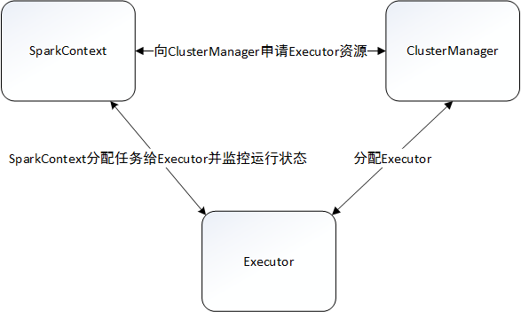
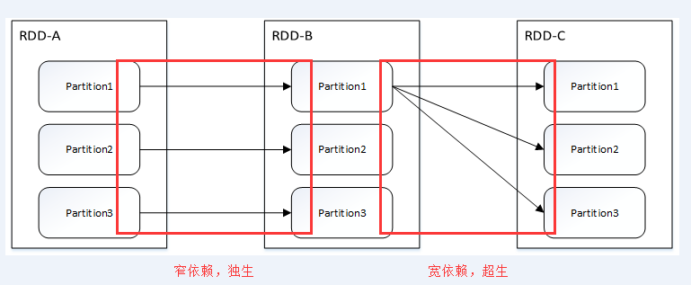
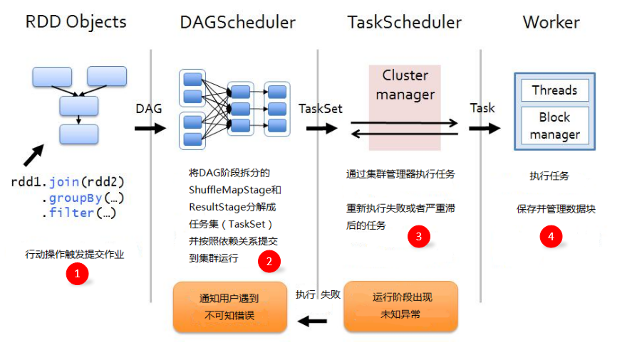

# spark

## 简介
- 专为大规模数据处理而设计的快速通用的计算引擎，是UC Bererkeley开源设计的，由scala开发。
- 对比Hadoop MapReduce
  - 更适用于以下场景：迭代任务（如梯度下降计算，map reduce要从硬盘进行读写，spark从内存进行读写）
                  交互式分析（hive延时大，因为要起一个单独的map reduce job，并且要从硬盘进行读写,Presto也有相应的问题）
  - 代码简洁                
- speed：100x faster -- DAG scheduler,query optimizer,physical execution engine
- API丰富:java,scala,python,r,sql  
- 通用性：spark sql,spark streaming,mllib,graphx
- runs everywhere：hadoop，standalone...

## spark运行架构 

   
	- https://cloud.tencent.com/developer/article/1004889
	- Spark的运行架构基本由三部分组成，包括SparkContext（驱动程序）、ClusterManager（集群资源管理器）和Executor（任务执行进程）。 
	- 运行模式：Standalone、Yarn、Mesos
	- 一个物理节点可以有一个或多个worker,一个worker可以有一个或多个executor，一个executor可以有多个cpu core
	- 一个partition对应一个task,cores代表可以同时并行的task数，因此task数不要超过cores数量太多
	- Driver向Master申请资源；Worker负责监控自己节点的内存和CPU情况，并向Master汇报；Master给Worker分配资源，时刻知道Worker的资源状况
	- shuffle：将分布在集群中多个节点上的同一个key，拉取到同一个节点上，进行聚合或join等操作（比如reduceByKey、join、distinct、repartition等算子）。代价很大：重新进行数据分区，数据传输
	- yarn-cluster，yarn-client
	yarn-cluster：适用于生产环境
	yarn-client：适用于交互和调试

##  RDD（弹性分布式数据集）

1. RDD 的操作类型　

RDD大致可以包括四种操作类型：

    创建操作（Creation）：从内存集合和外部存储系统创建RDD，或者是通过转换操作生成RDD
    转换操作（Transformation）： 转换操作是惰性操作，只是定义一个RDD并记录依赖关系，没有立即执行　
		create a new dataset: map,filter,flatMap,mapPartitions,sample,union,join,groupByKey,distinct
    控制操作（Control）：进行RDD的持久化，通过设定不同级别对RDD进行缓存
    行动操作（Action）：触发任务提交、Spark运行的操作，操作的结果是获取到结果集或者保存至外部存储系统　
		return a value to the driver program:reduce,collect,count,foreach

2. RDD的实现

2.1 RDD的分区

RDD的分区是一个逻辑概念，转换操作前后的分区在物理上可能是同一块内存或者存储。在RDD操作中用户可以设定和获取分区数目，默认分区数目为该程序所分配到的cpu核数，如果是从HDFS文件创建，默认为文件的分片数。

2.2 RDD 的“血统”和依赖关系

“血统”和依赖关系：RDD的容错机制是通过记录更新来实现的，且记录的是粗粒度的转换操作。我们将记录的信息称为血统（Lineage）关系，而到了源码级别，Apache Spark 记录的则是 RDD 之间的依赖（Dependency）关系。如上所示，每次转换操作产生一个新的RDD（子RDD），子RDD会记录其父RDD的信息以及相关的依赖关系。　

falut tolerance：任何partition丢失了，都可以从头恢复

2.2 依赖关系

窄依赖：父RDD的每个分区只被子RDD的一个分区所使用，子RDD的任务可以跟父RDD在同一个Executor一起执行，不需要经过 Shuffle 阶段去重组数据。：map、filter、union、join with inputs co-partitioned(父RDD hash-partitioned),mapPartitions,mapValues
宽依赖：父RDD的每个分区被子RDD的多个分区所使用，父 RDD 与子 RDD 之间存在着 Shuffle 过程。：groupByKey、join with inputs not co-partitioned（父RDD 不是 hash-partitioned)
窄依赖对优化有利：
  宽依赖对应shuffle操作，开销大
  当RDD分区丢失时，窄依赖只需要计算和子RDD分区对应的父RDD分区即可，宽依赖要计算多个父RDD分区，甚至是全部分区

3. 作业执行原理

作业（Job）：RDD每一个行动操作都会生成一个或者多个调度阶段
 
调度阶段（Stage）：每个Job都会根据依赖关系，以Shuffle过程作为划分，分为Shuffle Map Stage和Result Stage。每个Stage包含多个任务集（TaskSet），TaskSet的数量与分区数相同。　

任务（Task）：分发到Executor上的工作任务，是Spark的最小执行单元　
 
DAGScheduler：DAGScheduler是面向调度阶段的任务调度器，负责划分调度阶段并提交给TaskScheduler　

TaskScheduler：TaskScheduler是面向任务的调度器，它负责将任务分发到Woker节点，由Executor进行执行　

- DAG图
spark有两类task： shuffleMapTask ---- 输出shuffle所需数据
                 resultTask ---- 输出result
stage划分：从后往前推，遇到宽依赖就断开，划分为一个stage，遇到窄依赖就将这个RDD加入该stage中                 

## spark安装
- export SPARK_HOME=/datayes/spark/spark-2.3.1-bin-hadoop2.7
- 开通连接到集群的端口

## 提交任务
  spark-submit
  先定义SparkContext，SparkConf ： 表明和集群的连接方式 （spark-shell模式下已经定义好了）

  
  
