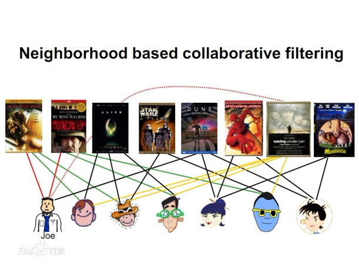
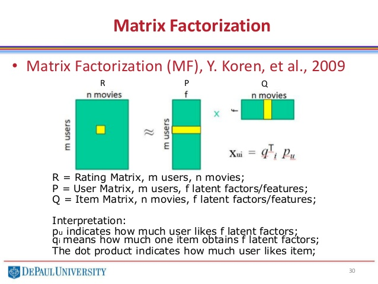
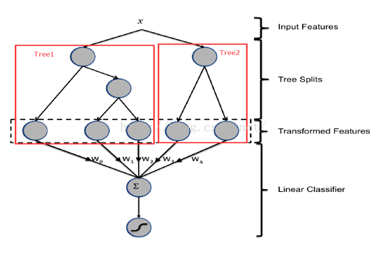
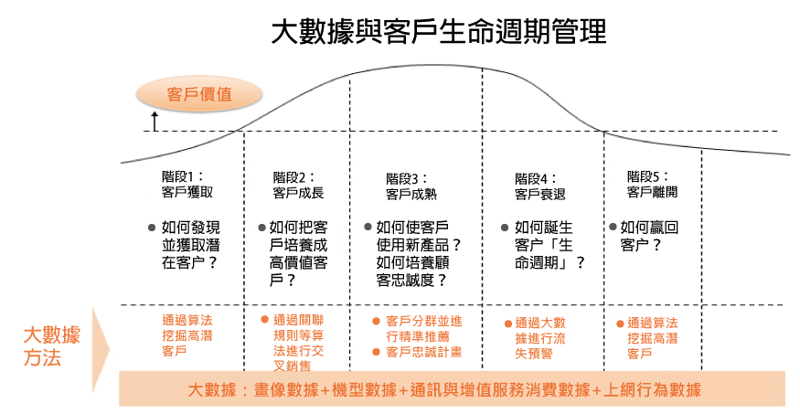
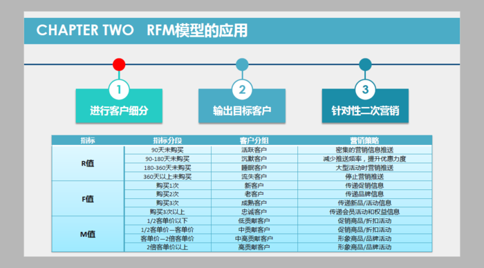

# 一. 金融产品推荐

## 1. 算法介绍
  - 推荐系统可以帮助我们发现用户已经展现出来的，或者潜在的偏好，从众多的产品中过滤出符合用户兴趣的产品，从而在有限的展示机会中，抓住用户的兴趣，提升用户的转化率。
  - 好的推荐系统不仅仅能够 **准确预测用户的行为，而且能够扩展用户的视野，帮助用户发现那些他们可能会感兴趣，但却不那么容易发现的东西** 。同时，推荐系统还要能够帮助商家将那些被埋没在长尾的好商品介绍给可能会对它们感兴趣的用户。

- 1.1 协同过滤(CF)

    - 基于物品的推荐

         

        - 是目前业界应用最多的算法，无论是亚马逊，还是Netflix、Youtube、Hulu，其推荐算法基础都是该算法。
        - 给用户推荐和他之前喜欢的物品相似的物品。
        - 物品间相似度的计算基于用户的行为，基本的逻辑是：如果喜欢A物品的用户大多也喜欢B用品，则认为A物品和B物品之间具有很大的相似度。
        - 考虑到热门商品会同时被很多用户购买，因此在计算中要降低热门商品的权重。
        - 适用于物品数远小于用户数的场景。

    - 隐语义模型

        

        - 源于Netflix百万美金推荐大赛
        - 利用用户行为数据，将用户和产品自动分类，从而发现用户潜在的兴趣

- 1.2. 点击率预估(CTR)
    - 通过用户历史行为，预测用户点击/购买一个产品的概率，再根据这个预估的点击率对物品排序输出。
    - 广泛应用于互联网广告领域
    - facebook提出的GBDT+LR模型融合算法，通过GBDT产生高阶特在组合，LR可以有效的对这些特征生成概率值
    

- 1.3. 冷启动
    推荐系统是典型的“贪婪型”数据应用，在我们还没有拿到足够的数据时（如新用户、新产品），可以采取冷启动策略，给用户进行初始化的推荐，在获得用户行为/交易数据后，再优化推荐内容。包含以下几种策略：
    - 基于热销产品的推荐
        - 适用于用户冷启动
        - 推荐各个品类销售最好的产品
    - 基于专家知识的推荐
        - 适用于用户冷启动
        - 分析产品历史数据，比如某一类产品购买者大多是男性，那么可以对新注册的男用户推荐该产品
    - 基于内容的推荐
        - 适用于物品冷启动的场景
        - 对物品提取标签，推荐与用户历史行为相匹配的产品

- 1.4. 优势：丰富的金融数据 
    - 通联数据丰富的金融产品数据，可以帮助更好地刻画金融产品，提升推荐效果
    - 公募基金/私募基金/期货期权/A股/港股/ 。。。
    - 基本资料、每日行情 。。。

## 2. 本次数据集demo

- 2.1 训练数据
    - 用户购买金融产品的记录：766条
    - 268个用户，186个产品
    - 见“xibu_holddf.csv”

- 2.2 模型结果
    - 见“recom.xlsx”
    - 推荐精度
        - 预测结果和用户实际购买行为之间计算RMSE : 0.76
    - topN推荐结果

| 推荐产品数量 | Recall | Precision |
| ------ | ------ | ------ |
| 5 | 72.5% | 22% |
| 10 | 84.8% | 12.9% |
| 15 | 88% | 9.3% |

注：令R(u)是根据用户在训练集上的行为给用户作出的推荐列表，而T(u)是用户在测试集上的购买列表，那么Recall(召回率)和Precision(准确率)定义为：

$$Recall= \frac{\sum(R(u)\cap(T(u)))}{\sum(T(u))}$$
$$Precision= \frac{\sum(R(u)\cap(T(u)))}{\sum(R(u))}$$

- 存在问题：demo数据量较少，通过增大数据量，模型效果应有提升。

---
# 二. 用户生命周期管理
## 1. 算法介绍
- 生命周期分类
    - 
    - 运用RFM(Recency,Frequency,Monetary)等模型进行合理的用户细分
    - 
- 流失用户预警
    - 通过数据挖掘技术对过往已流失的客户特征进行分析与判断，生成预警名单，然后根据业务规则对客户状态的判断，按名单生成顺序和价值流失情况分别对名单进行调整，将客户预警级别进行分级，最终生成预警客户名单。结合已有的活动或服务策略，通过已构建的流失用户激活模型，对将要流失的用进行相应的营销，对已流失的用户进行激活。

## 2. 本次数据集展示