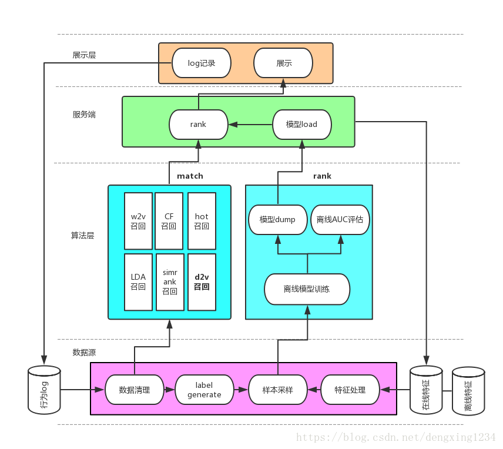

## 信息流相关推荐算法体系(苏哲文)

https://blog.csdn.net/dengxing1234/article/details/79756265

一. 算法架构

- 召回算法：包含了多个渠道的召回模型，如协同过滤，主题模型，内容召回和热点召回等，能够从数据库中选出多样性的偏好内容；
- 排序算法：对多个召回渠道的内容进行统一打分排序，选出最优的少量结果。

二. 技术细节
1. 召回算法（match）
1.1 基于用户行为的召回
    - 离线cf(ALS)
        利用基于itemBased的协同过滤生成离线的item2item相似度矩阵和用户的离线推荐结果，其中优化过程包括基于艾宾浩斯遗忘曲线按照时间进行降权、弱化热点影片的权重以及矩阵分解。
    - word2vev召回
        根据用户行为，将全部影片作为语料库，每个用户的观看历史按照时序排序视为文档，利用w2v算法原理计算所有item的词向量；
        根据词向量距离计算item2item的相似度矩阵
    - lda召回
        基于概率主题模型：文档-潜在主题-词的三级关系，映射到用户行为数据上，即用户-潜在兴趣-资源；
        通过用户历史行为记录，提取LDA的中间产物，即用户的潜在兴趣向量，以及资源的潜在主题分布向量
        基于item的主题向量，进行item2item的相似度计算
    - SimRank召回
        将user与deal的关系视作一个二部图，基于graph-based算法相似关系可以在图上传播的思想，使用simran计算item相似队列

1.2 基于内容的召回
    - 基于title简介
        基于影片的文本简介部分使用doc2vector，计算出每个资源的表示向量
        基于资源的向量，进行item2item的相似度计算
    - 基于style(风格)
    - 基于tag(标签)

1.3 EE问题&冷启动问题
    - 冷启动用户召回
        计算资源得分(例如电影：根据imbd算法)，根据不同时间周期进行得分融合并线上进行ab对比，选取最优的时间周期组合
        按照imbd得分进行倒排，生成热点召回数据
    - 冷启动资源召回
        基于资源库，统计各个资源的点击和播放率，按一定比例召回点击/播放率低的item
    - EE问题
        method1：调整不同召回渠道的配比方式来保证一定的多样性
        method2：randit算法
        method3：强化学习

2. 排序算法(rank)
2.1 baseline：lr
    - 优点：简单，解释性强，并行化程度高，实时预测性能可以得到保证
    - 缺点：需要大量的人工特征组合

2.2 特征工程
- 特征分类
    - 按基本来源分类
        - item特征：资源风格、地域、类型、标签、以及相应的统计特征等
        - user特征：性别、年龄、婚姻状况、收入预测等
        - context特征：网络状态、时间段、年龄等
        - 交叉特征：user/item/context交叉
    - 按更新频率分类
        - 离线特征：一段时间变化幅度小的特征，如user/item的基本特征和统计特征
        - 近在线特征：分钟级/小时级需要更新的特征，如item近4个小时的ctr等
        - 在线特征：需要在每次请求到达时，实时获取的特征，如网络状态、当前请求时间等

- 特征处理
    - 特征扩充
    >(1) 用户兴趣向量：lda的中间产物之一用户潜在兴趣向量，以及基于w2v的词向量和用户行为历史统计出的用户兴趣向量，可丰富用户维度上的兴趣特征。 
     (2) 资源embedding向量：基于用户行为数据进行的embedding的w2v/lda的词向量，以及基于资源本身title的doc2vector都可丰富最近模型使用的特征维度。且word2vecor和lda由于原理上的区别，可拓展出不同意义上的特征向量。 
     (3) 资源封面AutoEncode向量：基于资源封面图像，离线采用AutoEncode训练，提取隐层向量，作为资源本身特征。

    - 统计特征细化
    >(1) 特征工程时间窗口细化： 将资源的统计特征，按不同的时间窗口，如1,3,5,7,15天进行特征细化，可在丰富资源特征的同时，融入时间衰减的因素。 
    (2) 在线特征交叉：对于一些资源统计特征，在与用户特征以及上下文特征进行交叉之后效果会更加明显，根本原因在于增加了样本特征的区分度；具体交叉方法的落地，建议由服务端是执行，这里比如一个男性用户发来请求，服务端可实时获取用户的性别特征（男）以及召回队列中每个资源的在不同性别上统计特征（如历史CTR），基于特征编码表，新增加交叉特征(sex_cross_ctr)，并将每个资源在男性上的ctr上作为新增交叉特征的特征值，记录成log，后面回流给模型样本。其实所有的在线特征都和交叉特征一样，最后都由服务端的日志回流给模型训练过程。

    - 连续特征离散化 & 统一独热编码
    >(1) 当然，它归一化和这里离散化的方法的考虑点几乎一致。即由于不同维度特征的取值分布、相同维度下特征值的差异都很大。如很多特征的数据服从长尾分布。直接基于该特征进行常规的归一化方法（例如 min-max， z-score）都只是对数据的分布进行平移和拉伸，最后特征的分布仍然是长尾分布，这就导致大部分样本的特征值都集中在非常小的取值范围内，使得样本特征的区分度减小；与此同时，少量的大值特征可能造成训练时的波动，减缓收敛速度。此外也可以对特征值做对数转化，但由于不同维度间特征的分布不同，这种特征值处理的方式并不一定适用于其他维度的特征。 
    https://tech.meituan.com/recommend_dnn.html
     (2) **考虑到LR模型的特性，这里的方法是先对连续特征先进行等频离散化，即基于特征值的频率等频分成N个桶，并做0/1标识，最后和离散型特征，统一进行One-hot编码，喂给LR模型**。
     **在工业界，很少直接将连续值作为逻辑回归模型的特征输入，而是将连续特征离散化为一系列0、1特征交给逻辑回归模型**，这样做的优势有以下几点：
     0. 离散特征的增加和减少都很容易，易于模型的快速迭代；
     1. 稀疏向量内积乘法运算速度快，计算结果方便存储，容易扩展；
     2. 离散化后的特征对异常数据有很强的鲁棒性：比如一个特征是年龄>30是1，否则0。如果特征没有离散化，一个异常数据“年龄300岁”会给模型造成很大的干扰；
     3. 逻辑回归属于广义线性模型，表达能力受限；单变量离散化为N个后，每个变量有单独的权重，相当于为模型引入了非线性，能够提升模型表达能力，加大拟合；
     4. 离散化后可以进行特征交叉，由M+N个变量变为M*N个变量，进一步引入非线性，提升表达能力；
     5. 特征离散化后，模型会更稳定，比如如果对用户年龄离散化，20-30作为一个区间，不会因为一个用户年龄长了一岁就变成一个完全不同的人。当然处于区间相邻处的样本会刚好相反，所以怎么划分区间是门学问；
     6. 特征离散化以后，起到了简化了逻辑回归模型的作用，降低了模型过拟合的风险。

     李沐曾经说过：模型是使用离散特征还是连续特征，其实是一个“海量离散特征+简单模型” 同 “少量连续特征+复杂模型”的权衡。既可以离散化用线性模型，也可以用连续特征加深度学习。就看是喜欢折腾特征还是折腾模型了。通常来说，前者容易，而且可以n个人一起并行做，有成功经验；后者目前看很赞，能走多远还须拭目以待。

    https://www.zhihu.com/question/31989952/answer/54184582

2.3 采样策略

https://www.jianshu.com/p/2ab122e8355e
