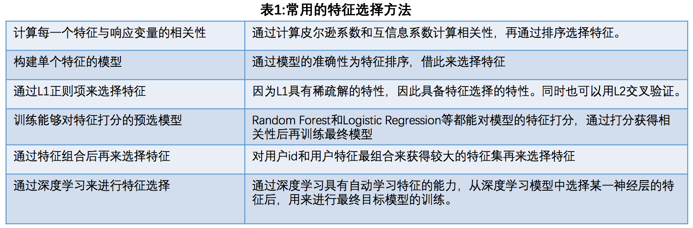
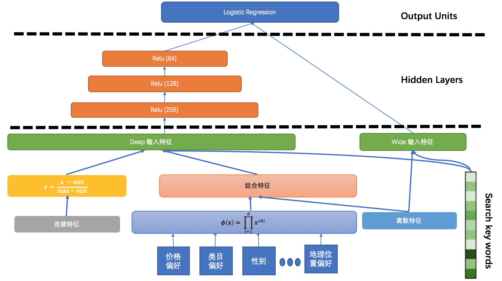

https://tech.meituan.com/dl.html

- 召回层
    - user-based：找出与当前User X最相似的N个User，并根据N个User对某Item的打分估计X对该Item的打分。在相似度算法方面，我们采用了Jaccard Similarity
    - item-based：我们先用word2vec对每个Item取其隐含空间的向量，然后用Cosine Similarity计算用户u用过的每一个Item与未用过Item i之间的相似性。最后对Top N的结果进行召回。
    - model-based ： ALS
    - query-based：是根据Query中包含的实时信息（如地理位置信息、WiFi到店、关键词搜索、导航搜索等）对用户的意图进行抽象，从而触发的策略。
    - location-based：移动设备的位置是经常发生变化的，不同的地理位置反映了不同的用户场景，可以在具体的业务中充分利用。在推荐的候选集召回中，我们也会根据用户的实时地理位置、工作地、居住地等地理位置触发相应的策略。

- 排序层
1. 框架
    - 离线计算层：离线计算层主要包含了算法集合、算法引擎，负责数据的整合、特征的提取、模型的训练、以及线下的评估。
    - 近线实时数据流：主要是对不同的用户流实施订阅、行为预测，并利用各种数据处理工具对原始日志进行清洗，处理成格式化的数据，落地到不同类型的存储系统中，供下游的算法和模型使用。
    - 在线实时打分：根据用户所处的场景，提取出相对应的特征，并利用多种机器学习算法，对多策略召回的结果进行融合和打分重排。
2. 模型：Wide & Deep
2.1 特征选择

2.2 特征处理
- 特征组合：如“用户是否在常住地”，“商户与用户当前距离”
- 归一化
- 快速聚合

2.3 优化器选择(Optimizer)
在深度学习中，选择合适的优化器不仅会加速整个神经网络训练过程，并且会避免在训练的过程中困到鞍点。文中会结合自己的使用情况，对使用过的优化器提出一些自己的理解。
- SGD：Stochastic Gradient Descent
每次迭代计算Mini-Batch梯度，然后对参数进行更新，缺点是对于损失方程有比较严重的振荡，并且容易收敛到局部最小值。
- Momentum：为了克服SGD振荡比较严重的问题，Momentum将物理中的动量概念引入到SGD当中，通过积累之前的动量来替代梯度，加快收敛并减小振荡。
- Adagrad：相较于SGD，Adagrad相当于对学习率多加了一个约束。Adagrad的优点是，在训练初期，由于gt较小，所以约束项能够加速训练。而在后期，随着gt的变大，会导致分母不断变大，最终训练提前结束。
- Adam：结合了Momentum与Adagrad的产物，它既考虑到了利用动量项来加速训练过程，又考虑到对于学习率的约束。利用梯度的一阶矩估计和二阶矩估计动态调整每个参数的学习率。Adam的优点主要在于经过偏置校正后，每一次迭代学习率都有个确定范围，使得参数比较平稳。
通过实践证明，Adam结合了Adagrad善于处理稀疏梯度和Momentum善于处理非平稳目标的优点，相较于其他几种优化器效果更好。

2.4 损失函数的选择
Cross Entropy相比于在线性模型中表现比较好的平方差函数有着比较明显的优势。

2.5 Wide&Deep模型框架

在离线阶段，我们采用基于Theano、Tensorflow的Keras作为模型引擎。在训练时，我们分别对样本数据进行清洗和提权。在特征方面，对于连续特征，我们用Min-Max方法做归一化。在交叉特征方面，我们结合业务需求，提炼出多个在业务场景意义比较重大的交叉特征。在模型方面我们用Adam做为优化器，用Cross Entropy做为损失函数。在训练期间，与Wide & Deep Learning论文中不同之处在于，我们将组合特征作为输入层分别输入到对应的Deep组件和Wide组件中。然后在Deep部分将全部输入数据送到3个ReLU层，在最后通过Sigmoid层进行打分。我们的Wide＆Deep模型在超过7000万个训练数据中进行了训练，并用超过3000万的测试数据进行线下模型预估。我们的Batch－Size设为50000，Epoch设为20。