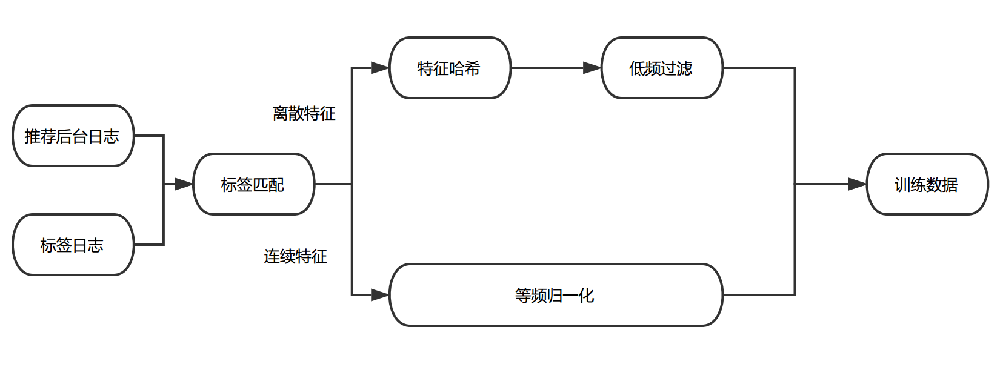

https://tech.meituan.com/recommend_dnn.html

一. 特征处理
1. 特征种类
User特征：用户年龄，性别，婚否，有无孩子等
Item特征：价格，折扣，品类和品牌相关特征，短期和长期统计类特征等
Context特征：天气，时间，地理位置，温度等
用户行为：用户点击Item序列，下单Item序列等
交叉特征

2. 样本和特征预处理

- 标签匹配
推荐后台日志会记录当前样本对应的User特征、Item特征与Context特征，Label日志会捕获用户对于推荐项的行为反馈。我们把两份数据按照唯一ID拼接到一起，生成原始的训练日志。

- **等频归一化**
通过对训练数据的分析，我们发现不同维度特征的取值分布、相同维度下特征值的差异都很大。例如距离、价格等特征的数据服从长尾分布，体现为大部分样本的特征值都比较小，存在少量样本的特征值非常大。常规的归一化方法（例如 min-max， z-score）都只是对数据的分布进行平移和拉伸，最后特征的分布仍然是长尾分布，这就导致大部分样本的特征值都集中在非常小的取值范围内，使得样本特征的区分度减小；与此同时，少量的大值特征可能造成训练时的波动，减缓收敛速度。此外也可以对特征值做对数转化，但由于不同维度间特征的分布不同，这种特征值处理的方式并不一定适用于其他维度的特征。

在实践中，我们参考了Google的Wide & Deep Model[6]中对于连续特征的处理方式，根据特征值在累计分布函数中的位置进行归一化。即将特征进行等频分桶，保证每个桶里的样本量基本相等，假设总共分了n个桶，而特征xi属于其中的第bi(bi ∈ {0, ..., n - 1})个桶，则特征xi最终会归一化成 bi/n。这种方法保证对于不同分布的特征都可以映射到近似均匀分布，从而保证样本间特征的区分度和数值的稳定性。

- **低频过滤**
过多的极为稀疏的离散特征会在训练过程中造成过拟合问题，同时增加参数的储存数量。为避免该问题，我们对离散特征进行了低频过滤处理，丢掉小于出现频次阈值的特征。

经过上述特征抽取、标签匹配、特征处理后，我们会给特征分配对应的域，并对离散特征进行 **Hash处理**，最终生成LIBFFM格式的数据，作为Multi-task DNN的训练样本。下面介绍针对业务目标所做的模型方面的优化尝试。

二. 模型结构优化
- **Multi-task DNN**

推荐场景上的优化目标要综合考虑用户的点击率和下单率。在过去我们使用XGBoost进行单目标训练的时候，通过把点击的样本和下单的样本都作为正样本，并对下单的样本进行上采样或者加权，来平衡点击率和下单率。但这种样本的加权方式也会有一些缺点，例如调整下单权重或者采样率的成本较高，每次调整都需要重新训练，并且对于模型来说较难用同一套参数来表达这两种混合的样本分布。针对上述问题，我们利用DNN灵活的网络结构引入了Multi-task训练。

根据业务目标，我们把点击率和下单率拆分出来，形成两个独立的训练目标，分别建立各自的Loss Function，作为对模型训练的监督和指导。DNN网络的前几层作为共享层，点击任务和下单任务共享其表达，并在BP阶段根据两个任务算出的梯度共同进行参数更新。网络在最后一个全连接层进行拆分，单独学习对应Loss的参数，从而更好地专注于拟合各自Label的分布。

Multi-task DNN的网络结构如上图所示。线上预测时，我们将Click-output和Pay-output做一个线性融合。

- **Missing Value Layer**
通常在训练样本中难以避免地有部分连续特征存在缺失值，更好地处理缺失值会对训练的收敛和最终效果都有一定帮助。通常处理连续特征缺失值的方式有：取零值，或者取该维特征的平均值。取零值会导致相应权重无法进行更新，收敛速度减慢。而取平均值也略显武断，毕竟不同的特征缺失所表示的含义可能不尽相同。一些非神经网络的模型能比较合理的处理缺失值，比如XGBoost会通过Loss的计算过程自适应地判断特征缺失的样本被划分到左子树还是右子树更优。受此启发，我们希望神经网络也可以通过学习的方式自适应地处理缺失值，而不是人为设置默认值。因此设计了如下的Layer来自适应的学习缺失值的权重:

通过上述的Layer，缺失的特征可以根据对应特征的分布去自适应的学习出一个合理的取值。

通过离线调研，对于提升模型的训练效果，自适应学习特征缺失值的方法要远优于取零值、取均值的方式。

- **KL-divergence Bound** ? 
我们同时考虑到，不同的标签会带有不同的Noise，如果能通过物理意义将有关系的Label关联起来，一定程度上可以提高模型学习的鲁棒性，减少单独标签的Noise对训练的影响。例如，可以通过MTL同时学习样本的点击率，下单率和转化率(下单/点击)，三者满足p(点击) * p(转化) = p(下单)的意义。因此我们又加入了一个KL散度的Bound，使得预测出来的p(点击) * p(转化)更接近于 p(下单)。但由于KL散度是非对称的，即KL(p||q) != KL(q||p)，因此真正使用的时候，优化的是 KL(p||q) + KL(q||p)。

- **NFM** ?
为了引入Low-order特征组合，我们在Multi-task DNN的基础上进行了加入NFM的尝试。各个域的离散特征首先通过Embedding层学习得到相应的向量表达，作为NFM的输入，NFM通过Bi-Interaction Pooling的方式对输入向量对应的每一维进行2-order的特征组合，最终输出一个跟输入维度相同的向量。我们把NFM学出的向量与DNN的隐层拼接在一起，作为样本的表达，进行后续的学习。

NFM的输出结果为向量形式，很方便和DNN的隐层进行融合。而且从调研的过程中发现，NFM能够加快训练的收敛速度，从而更有利于Embedding层的学习。因为DNN部分的层数较多，在训练的BP阶段，当梯度传到最底层的Embedding层时很容易出现梯度消失的问题，但NFM与DNN相比层数较浅，有利于梯度的传递，从而加快Embedding层的学习。

通过离线调研，加入NFM后，虽然训练的收敛速度加快，但AUC并没有明显提升。分析原因是由于目前加入NFM模型部分的特征还比较有限，限制了学习的效果。后续会尝试加入更多的特征域，以提供足够的信息帮助NFM学出有用的表达，深挖NFM的潜力。

- **用户兴趣向量**
用户兴趣作为重要的特征，通常体现在用户的历史行为中。通过引入用户历史行为序列，我们尝试了多种方式对用户兴趣进行向量化表达。

Item的向量化表达：线上打印的用户行为序列中的Item是以ID的形式存在，所以首先需要对Item进行Embedding获取其向量化的表达。最初我们尝试通过随机初始化Item Embedding向量，并在训练过程中更新其参数的方式进行学习。但由于Item ID的稀疏性，上述随机初始化的方式很容易出现过拟合。后来采用先生成item Embedding向量，用该向量进行初始化，并在训练过程中进行fine tuning的方式进行训练。

用户兴趣的向量化表达：为生成用户兴趣向量，我们对用户行为序列中的Item向量进行了包括Average Pooling、 Max Pooling与Weighted Pooling三种方式的融合。其中Weighted Pooling参考了DIN的实现，首先获取用户的行为序列，通过一层非线性网络(Attention Net)学出每个行为Item对于当前要预测Item的权重(Align Vector)，根据学出的权重，对行为序列进行Weighted Pooling，最终生成用户的兴趣向量。计算过程如下图所示:

- **训练效率优化**
DNN模型训练框架：PS-Lite