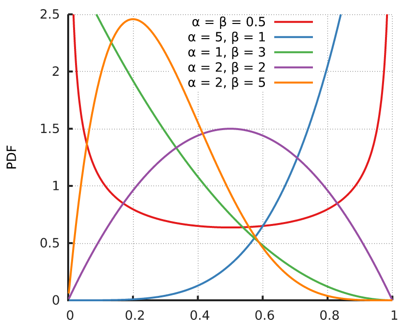

概率密度函数：描述连续型随机变量的概率分布

1. 伯努利分布(0-1分布)
- 进行单次伯努利试验，成功概率P(x=1)=p,失败概率P(x=0)=1-p，则称随机变量x服从伯努利分布

2. 二项分布
- n重伯努利试验成功次数的离散概率分布

3. beta分布
- 定义在(0,1)区间的连续概率分布，有两个参数$\alpha$,$\beta$
- 给出了所有概率出现的可能性大小，用参数来调节
- beta 分布图形中的 x 轴取值范围是 (0,1)，可以看成是概率值，参数 α 和 β 可以控制图形的形状和位置：

- beta分布特征
- α + β 的值越大，分布曲线越窄，也就是越集中。
- α/(α + β) 的值是 beta 分布的均值（期望值），它的值越大， beta 分布的中心越靠近 1，否则越靠近 0 。

4. 正态分布
