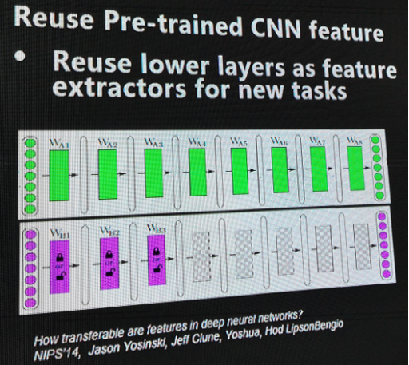
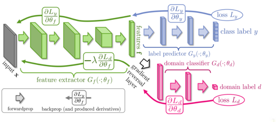

- 优点
    - higher start ： 直接应用现有知识
    - higher slope ： 训练更快
    - higher asymtote ： 数据要求少
- 常见的两种方法：
    - 先在成熟数据集(如ImageNet)上训练，固定前面几层的参数，在自有数据集上只训练后面几层参数。（甚至可以只取倒数第二层输出，作为特征，在新模型上训练）
    
    - 同时训练，固定前面几层的参数，有一层判断数据来自哪个数据集，成熟数据集数据和自有数据集数据进入不同层进行训练
    